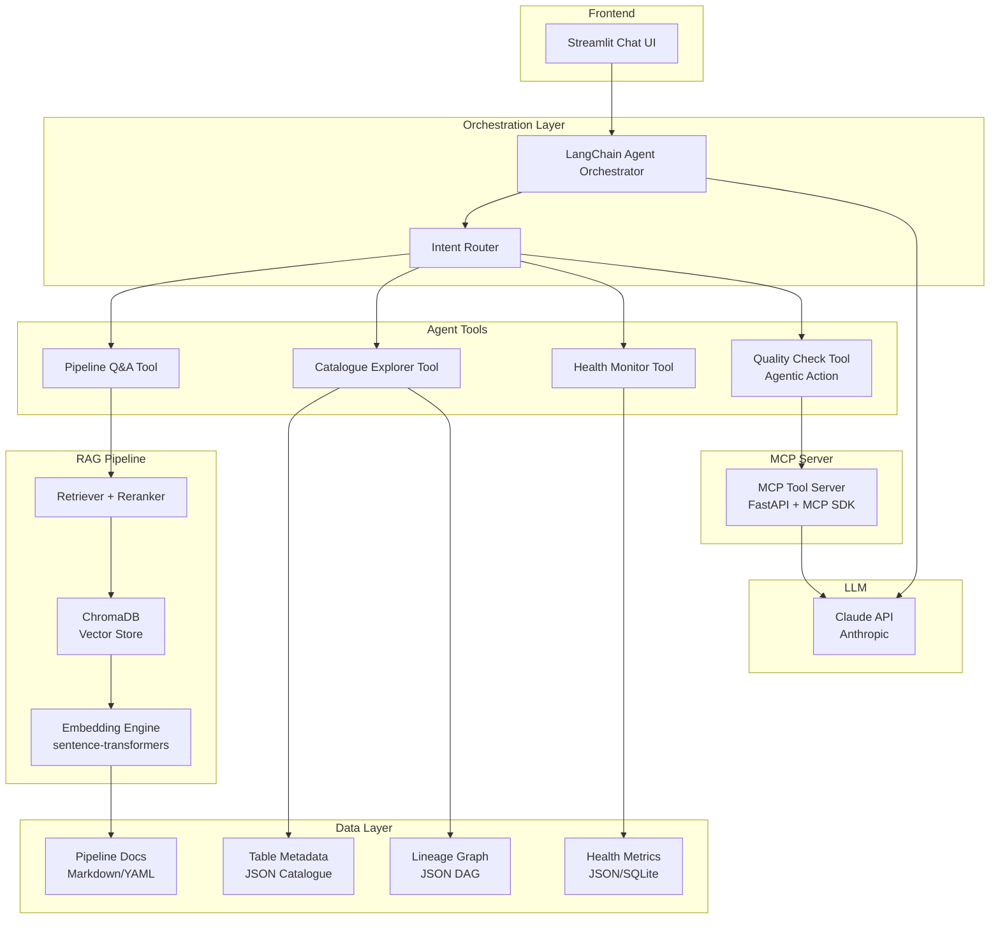

# RAG-Powered Data Engineering Assistant — Capstone Project

## Overview

Build a **conversational AI assistant** that helps data engineers with their daily workflows. This capstone project synthesizes all 15 days of learning from the GenAI for Data Engineers bootcamp across Foundation (Week 1), DE Productivity (Week 2), and DE Automation (Week 3).

The assistant provides:
- **Pipeline Codebase Q&A** — Ask about design decisions, understand code structure
- **Data Catalogue Exploration** — Find tables, understand lineage, check PII tags
- **Pipeline Health Status** — Current state, recent failures, SLO adherence
- **Agentic Actions** — Trigger data quality checks on demand

---

## Architecture



### Key Architecture Decisions

| Decision | Choice | Rationale |
|----------|--------|-----------|
| **Frontend** | Streamlit | Specified in requirements; rapid prototyping (Day 10) |
| **LLM** | Claude API (Anthropic) | Specified in requirements; strong tool-calling (Day 5) |
| **Vector DB** | ChromaDB | Lightweight, local, perfect for demos (Day 4) |
| **Embeddings** | `all-MiniLM-L6-v2` | Fast, good quality, runs locally (Day 4) |
| **Agent Framework** | LangChain + LangGraph | Multi-agent orchestration (Day 11) |
| **MCP** | MCP Python SDK | Expose tools as MCP endpoints (Day 5) |
| **Data Storage** | JSON + SQLite | Simple, portable, no external DB needed |

---

## Project Structure

```
d:\Antigravity-projects\de-ai-assistant\
├── app/
│   ├── __init__.py
│   ├── main.py                    # Streamlit entry point
│   ├── config.py                  # Settings & env config
│   │
│   ├── agents/
│   │   ├── __init__.py
│   │   ├── orchestrator.py        # LangGraph agent orchestrator
│   │   └── tools/
│   │       ├── __init__.py
│   │       ├── pipeline_qa.py     # RAG-based pipeline Q&A tool
│   │       ├── catalog_explorer.py # Data catalogue search tool
│   │       ├── health_monitor.py  # Pipeline health & SLO tool
│   │       └── quality_checker.py # Agentic quality check trigger
│   │
│   ├── rag/
│   │   ├── __init__.py
│   │   ├── ingestion.py           # Document chunking & embedding
│   │   ├── retriever.py           # Hybrid retriever (vector + keyword)
│   │   └── vectorstore.py         # ChromaDB setup & management
│   │
│   ├── mcp/
│   │   ├── __init__.py
│   │   └── server.py              # MCP server exposing tools
│   │
│   └── ui/
│       ├── __init__.py
│       ├── components.py          # Reusable Streamlit components
│       └── styles.py              # Custom CSS for Streamlit
│
├── data/
│   ├── pipeline_docs/             # Markdown docs about pipelines
│   │   ├── bronze_ingestion.md
│   │   ├── silver_transformation.md
│   │   ├── gold_aggregation.md
│   │   ├── architecture_decisions.md
│   │   └── runbook.md
│   │
│   ├── catalogue/                 # Table metadata
│   │   ├── tables.json            # 20 table definitions
│   │   └── lineage.json           # DAG lineage graph
│   │
│   └── health/                    # Pipeline health data
│       ├── pipeline_runs.json     # Run history with status
│       └── slo_config.json        # SLO definitions
│
├── notebooks/
│   └── demo_walkthrough.ipynb     # Jupyter demo notebook
│
├── tests/
│   ├── __init__.py
│   ├── test_rag.py                # RAG pipeline tests
│   ├── test_tools.py              # Agent tool tests
│   └── test_health.py             # Health monitor tests
│
├── slides/
│   └── presentation.md            # 10-slide deck (Marp format)
│
├── chroma_db/                     # ChromaDB persistent storage (gitignored)
├── requirements.txt
├── .env.example
├── .gitignore
└── README.md                      # Full project documentation
```

---

## Proposed Changes — Component Breakdown

### Component 1: Data Layer (Sample Data Generation)

Create realistic mock data that represents a real data engineering environment. This is the foundation everything else builds on.

#### [NEW] `data/pipeline_docs/bronze_ingestion.md`
Pipeline documentation describing the Bronze layer ingestion process — sources, connectors, incremental vs full load strategies, idempotency patterns.

#### [NEW] `data/pipeline_docs/silver_transformation.md`
Silver layer transformation docs — cleaning rules, deduplication, schema enforcement, SCD Type 2 handling.

#### [NEW] `data/pipeline_docs/gold_aggregation.md`
Gold layer aggregation docs — business metrics, materialized views, partitioning strategy.

#### [NEW] `data/pipeline_docs/architecture_decisions.md`
ADRs covering technology choices, why Bronze-Silver-Gold, retry strategies, monitoring approach.

#### [NEW] `data/pipeline_docs/runbook.md`
Operational runbook — common failure modes, remediation steps, escalation paths.

#### [NEW] `data/catalogue/tables.json`
20 table definitions with schema, descriptions, PII tags, owners, update frequency, row counts, last updated timestamps.

#### [NEW] `data/catalogue/lineage.json`
DAG representation of table lineage — which tables feed into which, transformation types.

#### [NEW] `data/health/pipeline_runs.json`
Simulated run history (last 30 days) with statuses (success, failed, partial), durations, row counts, error messages.

#### [NEW] `data/health/slo_config.json`
SLO definitions — freshness targets, completeness thresholds, max allowed null percentages.

---

### Component 2: RAG Pipeline (Days 4, 2, 1)

The core retrieval-augmented generation pipeline for answering questions about pipeline documentation.

#### [NEW] `app/rag/vectorstore.py`
- Initialize ChromaDB persistent client
- Create/load collection with cosine similarity
- Upsert and query functions

#### [NEW] `app/rag/ingestion.py`
- Recursive document loader for Markdown files
- Chunking strategy: RecursiveCharacterTextSplitter (chunk_size=500, overlap=50)
- Metadata extraction (source file, section headers)
- Embedding with `sentence-transformers/all-MiniLM-L6-v2`
- Batch upsert to ChromaDB

#### [NEW] `app/rag/retriever.py`
- Hybrid retrieval: vector similarity + keyword matching
- Top-K retrieval (k=5) with score threshold
- Context formatting for LLM prompt

---

### Component 3: Agent Tools (Days 5, 11, 12, 13, 14)

Four specialized tools that the LangChain agent can invoke.

#### [NEW] `app/agents/tools/pipeline_qa.py`
- Uses RAG retriever to find relevant pipeline documentation
- Formats context into a prompt for Claude
- Returns sourced answers with citations

#### [NEW] `app/agents/tools/catalog_explorer.py`
- Loads `tables.json` and `lineage.json`
- Search by table name, column name, PII tag, owner
- Lineage traversal (upstream/downstream)
- Natural language query parsing

#### [NEW] `app/agents/tools/health_monitor.py`
- Loads `pipeline_runs.json` and `slo_config.json`
- Current status of all pipelines
- Recent failures with error details
- SLO adherence calculation (freshness, completeness)
- Trend analysis (failure rate over time)

#### [NEW] `app/agents/tools/quality_checker.py`
- **Agentic action**: Trigger an on-demand data quality check
- Simulates running Great Expectations-style checks
- Validates: null percentages, schema conformance, row count anomalies
- Returns a structured quality report
- This is the key "agentic" capability — the assistant _acts_, not just answers

---

### Component 4: Agent Orchestrator (Days 11, 14)

#### [NEW] `app/agents/orchestrator.py`
- LangGraph-based agent with tool routing
- System prompt: "You are a Data Engineering Assistant..."
- Tool binding with Claude's native tool-calling
- Conversation memory (in-session)
- Reasoning traces logged for transparency

---

### Component 5: MCP Server (Day 5)

#### [NEW] `app/mcp/server.py`
- MCP Python SDK server
- Exposes all 4 agent tools as MCP-compatible endpoints
- Schema definitions for each tool's input/output
- Can be connected to Claude Desktop or other MCP clients

---

### Component 6: Streamlit UI (Day 10)

#### [NEW] `app/main.py`
- Chat interface with message history
- Sidebar with:
  - Pipeline health dashboard (mini cards)
  - Data catalogue quick search
  - System status indicators
- Tool execution visualization (show which tool was called)
- Source citations for RAG answers
- Dark theme with custom CSS

#### [NEW] `app/ui/components.py`
- `render_health_card()` — Pipeline status mini-cards
- `render_lineage_graph()` — Mermaid-style lineage visualization
- `render_quality_report()` — Formatted quality check results
- `render_source_citations()` — Expandable source references

#### [NEW] `app/ui/styles.py`
- Custom Streamlit CSS for dark theme
- Gradient accents, glassmorphism cards
- Chat bubble styling

---

### Component 7: Configuration & Setup

#### [NEW] `app/config.py`
- Pydantic settings for env vars
- API keys, model selection, paths
- ChromaDB configuration

#### [NEW] `requirements.txt`
```
streamlit>=1.30.0
langchain>=0.3.0
langchain-anthropic>=0.3.0
langchain-community>=0.3.0
langgraph>=0.2.0
chromadb>=0.5.0
sentence-transformers>=3.0.0
anthropic>=0.40.0
mcp>=1.0.0
python-dotenv>=1.0.0
pydantic>=2.0.0
pydantic-settings>=2.0.0
```

#### [NEW] `.env.example`
```
ANTHROPIC_API_KEY=sk-ant-xxxxx
EMBEDDING_MODEL=all-MiniLM-L6-v2
CHROMA_PERSIST_DIR=./chroma_db
```

#### [NEW] `.gitignore`
Standard Python gitignore + `chroma_db/`, `.env`

---

### Component 8: Documentation & Deliverables

#### [NEW] `README.md`
Comprehensive README covering:
- Project overview & motivation
- Architecture diagram
- Setup instructions
- Usage guide with screenshots
- API reference
- Technologies used (mapped to bootcamp days)

#### [NEW] `notebooks/demo_walkthrough.ipynb`
Interactive notebook demonstrating:
- RAG pipeline setup
- Individual tool testing
- Agent orchestration
- End-to-end conversation flow

#### [NEW] `slides/presentation.md`
10-slide Marp presentation:
1. Title & Problem Statement
2. Architecture Overview
3. RAG Pipeline Deep Dive
4. Agent Tools Demo
5. MCP Integration
6. Live Demo — Pipeline Q&A
7. Live Demo — Catalogue & Lineage
8. Live Demo — Health & SLO
9. Live Demo — Agentic Quality Check
10. Lessons Learned & Next Steps

---

## Bootcamp Topic Coverage Map

| Day | Topic | Where It's Used |
|-----|-------|-----------------|
| 1 | GenAI & LLM Landscape | Claude API integration, model selection |
| 2 | Prompt Engineering | System prompts, tool descriptions, structured output |
| 3 | AI Coding Assistants | Used to build this project! |
| 4 | RAG & Vector DBs | Core RAG pipeline with ChromaDB |
| 5 | MCP & Tool Calling | MCP server, Claude tool-calling |
| 6 | SQL, dbt & Data Modelling | Sample catalogue data modelled after dbt |
| 7 | Pipeline Development | Pipeline docs as knowledge base |
| 8 | Code Review & Docs | Auto-generated documentation |
| 9 | CI/CD, Testing | Test suite, quality checks |
| 10 | Vibe Coding & Prototyping | Streamlit rapid prototyping |
| 11 | Agentic AI Foundations | LangGraph agent orchestrator |
| 12 | AI Agents for Ingestion & Quality | Quality checker agentic tool |
| 13 | Lineage, Governance & Cataloguing | Catalogue explorer, PII detection |
| 14 | Self-Healing Pipelines & MLOps | Health monitoring, SLO adherence |
| 15 | Demo Day | Presentation slides, live demo |

---

## Verification Plan

### Automated Tests
```bash
# Run unit tests
python -m pytest tests/ -v

# Test RAG ingestion
python -m pytest tests/test_rag.py -v

# Test individual tools
python -m pytest tests/test_tools.py -v

# Test health monitor
python -m pytest tests/test_health.py -v
```

### Manual Verification
1. **Launch Streamlit app** — `streamlit run app/main.py`
2. **Test Pipeline Q&A** — Ask: "What is the retry strategy for Bronze ingestion?"
3. **Test Catalogue** — Ask: "Which tables contain PII data?"
4. **Test Health** — Ask: "Show me recent pipeline failures"
5. **Test Agentic Action** — Ask: "Run a quality check on the orders table"
6. **Test MCP** — Connect MCP client to the exposed server

### Browser Verification
- Open Streamlit app in browser
- Verify dark theme and UI styling
- Test full conversation flow
- Verify tool execution indicators

---

## Open Questions

> [!IMPORTANT]
> **Claude API Key**: Do you have an Anthropic API key ready? If not, I can configure it to use a mock/fallback mode for demo purposes.

> [!IMPORTANT]
> **Scope Preference**: The plan above is comprehensive. Would you like me to:
> - **(A)** Build the full project as described above
> - **(B)** Build a slimmer MVP first, then iterate

> [!NOTE]
> **Previous Project**: I see you had a Bronze-Silver-Gold pipeline project in a previous conversation. Should I reference/link that project's documentation as part of the knowledge base for this assistant?
